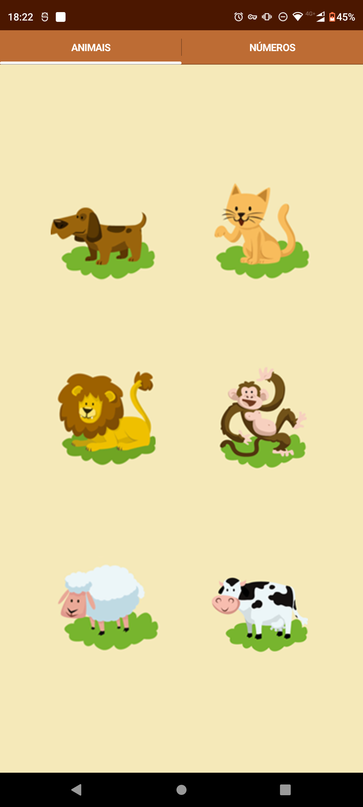
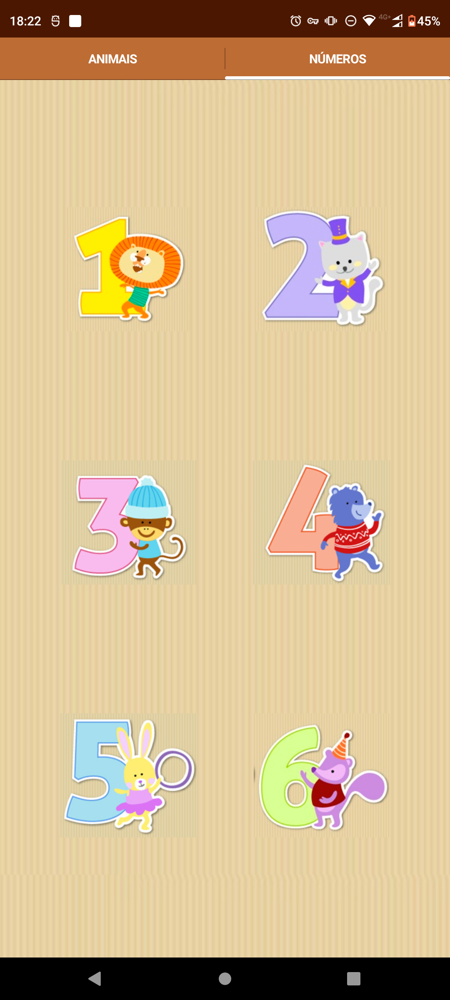

# Aprenda-Ingles-APP-Java-Medias
App que ao clicar nos animais ou numeros emite o som dos itens solicidados na linguagem ingles.

# Página de Animais
 

# Página de Números
 

# Video Apresentação

